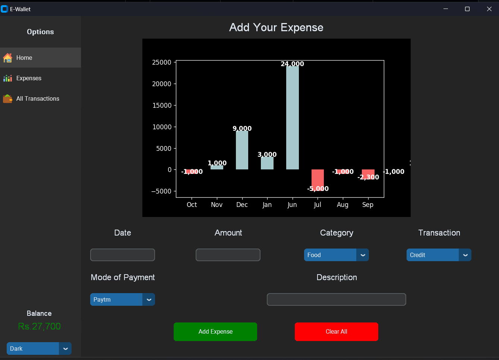

# Expense Tracker
"Expense Tracker" is a finance managing app designed to help you keep track of your spending and savings. With a user-friendly interface, this app makes it easy to stay on top of your finances.
This is developed using python with customtkinter. For now the data is being read by an excel sheet but development is in progress of making the app capable of automatically update all transaction information. And also i have plans to add proper database to this project. 
The app features light and dark mode support, allowing you to choose the theme that works best for you. You can view your overall balance and monthly expenses through interactive bar charts, making it easy to see where your money is going. You can also view your expenses for individual months through bar charts and see all your transactions for a specific month.
With Expense Tracker, you have the tools you need to make informed financial decisions. Try it out today and start taking control of your finances.

## How to run?
1. Open any IDE for python (preferably VScode)
2. Install all the packages/libraries mentioned in 'requirements.txt'
3. Run 'Login.py'

## How does it look?

###### Dashboard:

###### All Expenses:

###### Monthly Transactions:

###### Login:

###### Signup:

